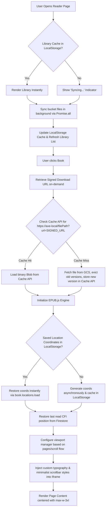

# axe

A professional, responsive notification dashboard and minimalist EPUB reader built with **Svelte 5 (Runes)**, **Tailwind CSS v4**, and **Firebase**. Push alerts from any CLI environment via `curl` and read books seamlessly with a zero-egress binary local caching system.

---

## Quick Start (Local Development)

1.  **Clone & Install**
    ```bash
    git clone https://github.com/dat267/axe267.git
    cd axe267
    npm install
    cd frontend && bun install && cd ..
    ```

2.  **Environment Setup**
    Create a `.env` file in the root directory using your Firebase project credentials:
    ```env
    VITE_FIREBASE_API_KEY=...
    VITE_FIREBASE_AUTH_DOMAIN=...
    VITE_FIREBASE_PROJECT_ID=...
    VITE_FIREBASE_STORAGE_BUCKET=...
    VITE_FIREBASE_MESSAGING_SENDER_ID=...
    VITE_FIREBASE_APP_ID=...
    VITE_FIREBASE_MEASUREMENT_ID=...
    ```

3.  **Run Development Server**
    ```bash
    npm run dev
    ```

---

## Reader Architecture & Developer Guide

This section serves as your complete developer reference for the Svelte-based EPUB reader inside `src/pages/Reader.svelte`. Returning to this codebase months from now, this guide will instantly re-orient you on the design decisions, caching structures, layout optimizations, and state management systems in play.

### High-Level System Architecture

The following diagram illustrates how the Reader handles data loading, verification, cache synchronization, and viewport rendering.



### Technical Implementations & Design Decisions

#### 1. Zero-Bandwidth Binary Caching (Cache API)
* **Goal:** Eliminate recurring Google Cloud Storage (GCS) bandwidth egress fees ($0.12/GB to the internet) and enable offline reading.
* **Mechanism:** Integrated the browser's native **Cache API** (`axe-epub-cache-v1`) to store EPUBs as binary `Blob`s.
* **Cache Key Structure:** `https://axe-local/[filePath]?url=[signedDownloadUrl]`
* **Zero-Latency Validation:** Rather than making a separate network metadata check on GCS, we leverage the Firebase Storage signed download URL itself. When a file is overwritten or modified on the server, Firebase rotates its cryptographic security token (the `&token=...` parameter changes). The changed URL creates a cache key mismatch, prompting the app to evict the stale cache, fetch the updated file, and save it automatically.
* **Offline Resiliency:** If GCS network requests fail (e.g., the device is offline), the app searches the local Cache API for the matching file path prefix and loads the last-cached version.

#### 2. High-Performance Library Syncing
* **Instant Start:** The catalog list is cached under `localStorage.getItem("axe_library_cache")`. It loads the bookshelf in milliseconds, providing an instant user interface for returning readers.
* **Background Syncing:** A background process queries GCS using parallelized `Promise.all` requests across active folders, keeping the library updated without blocking the UI.
* **On-Demand Signatures:** Firebase signed download URLs are fetched dynamically *only* when a book is opened, saving dozens of sequential network requests on library load.

#### 3. CPU-Heavy Pagination Optimization
* **The Problem:** EPUB.js location coordinate generation (`book.locations.generate(1600)`) blocks the single-threaded browser event loop, causing noticeable freezes on mobile browsers.
* **The Solution:** Coordinates are generated once and saved in `localStorage` under a unique key based on the book's title. On subsequent loads, the coordinates are restored instantly via `book.locations.load(saved)`, reducing coordinate restoration time to under 10 milliseconds.

#### 4. Layout & Viewport Optimization
* **Multi-Mode Support:** Traditional **Pages** (horizontal pagination) and **Scroll** (continuous vertical scrolling) are fully supported.
* **CFI Synchronization:** When switching between pages and scroll layouts, the viewport calculates the exact structural position (CFI) the user is currently looking at and re-renders the viewport on the exact same paragraph, avoiding any layout jumps.
* **Widescreen Reading Comfort & Spreads:** The main reading column dynamically resizes based on layout flow: scroll mode is capped at `max-w-3xl` (`768px`) for single-column reading, while pages mode spans the entire viewport width (`max-w-none`) with `spread: "auto"`. This automatically outputs a stunning 2-page book spread utilizing the full width of your widescreen monitor for maximum space utilization.

#### 5. Premium, Flat Aesthetics
* **Mobile Spacing Border Fix:** Removed left borders on drawers (`border-l-0 md:border-l border-border`) to avoid a bright vertical line on mobile screen edges while keeping the divider border on desktop.
* **Custom Scrollbars:** Sleek, thin (`6px` wide) custom scrollbars are styled globally in `app.css`. In addition, a custom `rendition.hooks.content` injection script pushes custom styles directly into the sandboxed EPUB iframe documents, maintaining a unified visual theme inside the book viewport.
* **Background Smoothness:** Added a transparent backdrop CSS injection (`html { background: transparent !important }`) inside the custom EPUB theme, eliminating dark-mode visual flashes.

#### 6. Dynamic Import Prefetching
* **Lazy Routing:** App pages are code-split and loaded via a custom, Svelte 5-compliant reactive `<Lazy>` component.
* **Browser Idle Prefetching:** Once the user mounts the Home page, the app leverages `requestIdleCallback` (with a safe `setTimeout` fallback) to quietly pre-fetch and cache the dynamic imports for `Reader.svelte`, `Settings.svelte`, `Integrations.svelte`, and `Notifications.svelte` in the background. Page transitions feel native and instantaneous.

### State & LocalStorage Cheat Sheet

The application maintains the following keys in the client's `localStorage` for state management:

| Key Name | Data Type / Structure | Purpose / Lifecycle |
| :--- | :--- | :--- |
| `axe_reader_settings` | `JSON Object` `{ fontSize, fontFamily, lineHeight, flow }` | Remembers typographic settings and active viewport layout (pages/scroll). Saved on adjustment, loaded on Mount. |
| `axe_reader_session` | `JSON Object` `{ name, url, filePath }` | Tracks the active book open in the Reader. Removed when the user exits the book. |
| `axe_library_cache` | `JSON Object` `{ collections: [...], tracks: [...] }` | Stores the library catalog layout and file entries. Instantly loaded on Mount before background sync. |
| `axe_locations_[title]` | `String` (EPUB.js locations map) | Caches pre-computed page coordinates for the specific book to bypass events loop rendering delays. |

### Maintenance Guidelines
* **Always run the development server during updates:** `npm run dev`.
* **Remove comments & blank lines inside modified code blocks:** To keep snippets clean, concise, and aligned with personal preferences, ensure any new script updates are written without verbose commentary and minimal spacing.
* **Zero Egress Mandate:** Never bypass the Cache API when fetching books. If you alter how files are fetched, ensure the signature-token validation (`url` query parameter) remains intact to prevent billing surprises on GCS.

---

## Production Deployment

This project uses **Firebase Hosting** for the frontend and **Google Cloud Run** for the Go backend.

### 1. Build & Deploy Manually

1.  **Frontend Build**
    ```bash
    npm run build
    ```

2.  **Deploy to Firebase Hosting**
    ```bash
    firebase deploy --only hosting
    ```

3.  **Deploy Go Backend to Cloud Run**
    ```bash
    gcloud run deploy axe-backend --source backend --region asia-southeast1
    ```

### 2. Automated Deployment
The project includes a GitHub Action in `.github/workflows/deploy.yml` that automatically deploys both the frontend and backend on every push to `main`. A separate release workflow (`.github/workflows/release.yml`) builds cross-platform backend binaries and frontend server binaries on every push.

---

## Tech Stack
- **Frontend:** Svelte 5 (Runes), JavaScript, Vite, Bun
- **Backend:** Go (Cloud Run), Firestore
- **Hosting:** Firebase Hosting
- **Styling:** Tailwind CSS v4
- **Testing:** Vitest
- **CI/CD:** GitHub Actions

## Releases

Every push to `main` publishes a release under the `axe/<sha>` tag containing:

- **Backend binaries** — `axe-backend-{linux,darwin,windows}-{amd64,arm64}` (Go)
- **Frontend binaries** — `axe-frontend-bun-{linux,darwin,windows}-{x64,arm64}` (Bun-compiled server)
- **Frontend static assets** — `axe-frontend-dist.tar.gz`

Only the 3 most recent releases are kept; older ones are automatically pruned.
